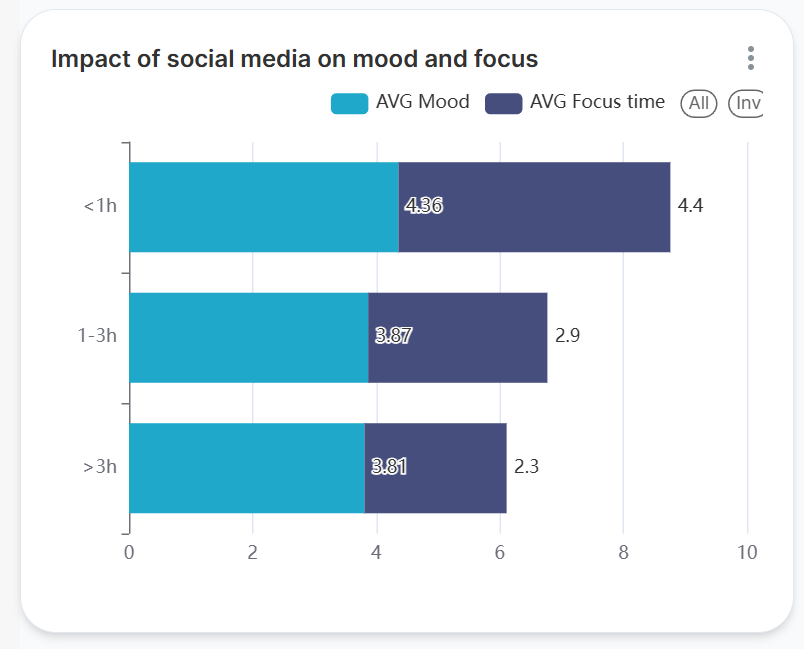
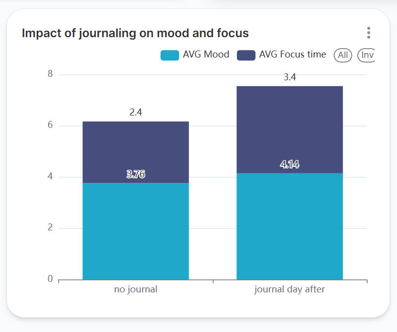
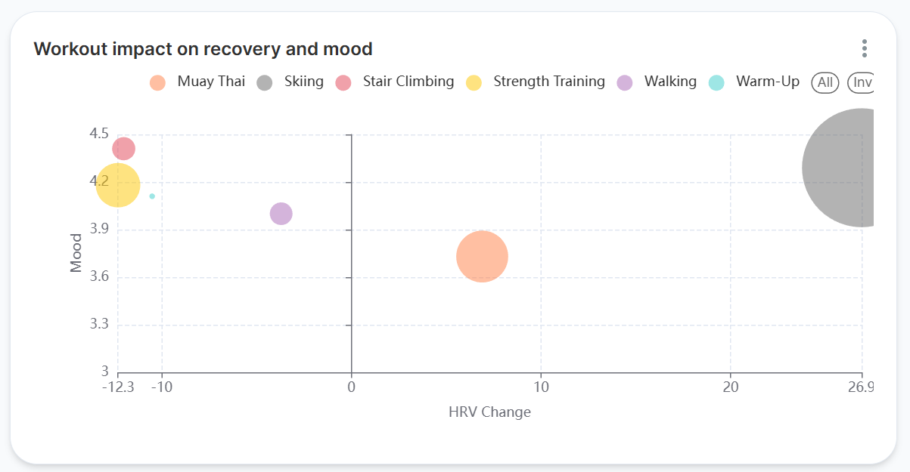
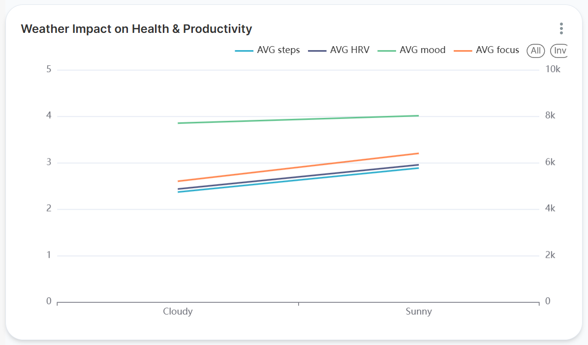
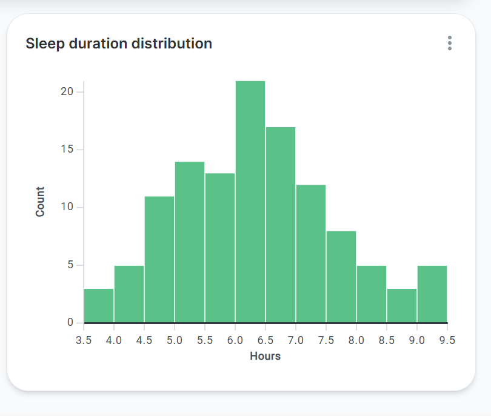
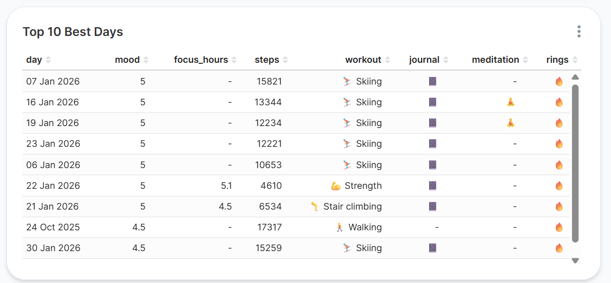
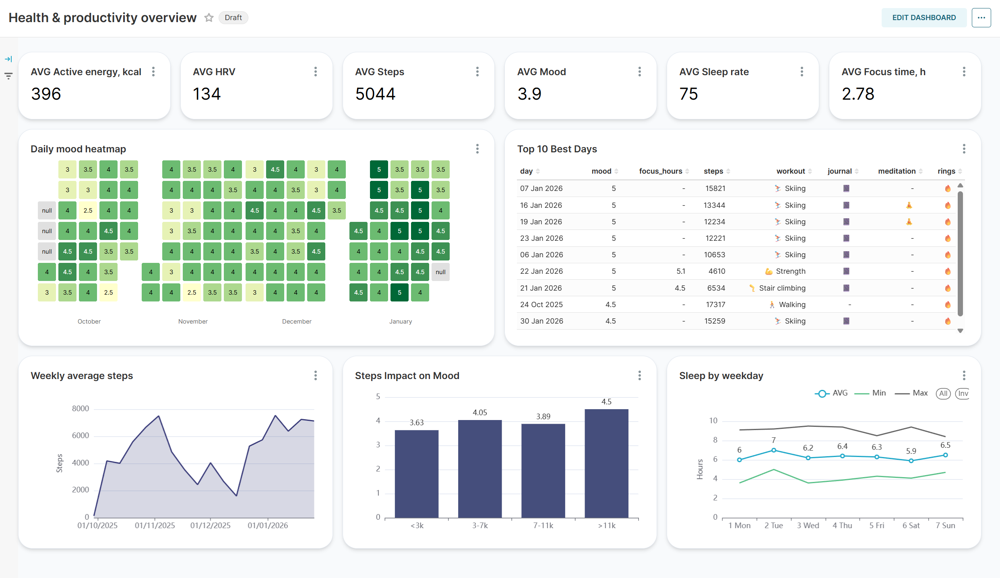
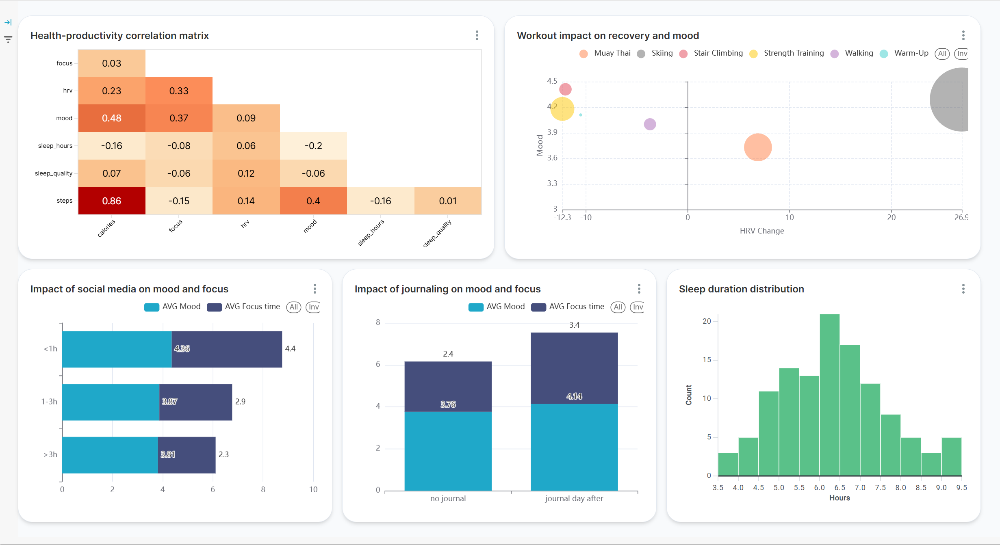

# 📊 Анализ персональных метрик здоровья и продуктивности

## Зачем этот проект?

**Цель:** Исследовать, как образ жизни, тренировки и привычки влияют на самочувствие и продуктивность, используя реальные данные с часов Apple Watch, приложений Forest и AutoSleep.

### Философия проекта

> Настоящий аналитик должен уметь работать с разными типами данных - не только с бизнес-метриками, но и с данными о себе. В конце концов, **хороший аналитик = продуктивный и здоровый аналитик**. Этот проект - попытка применить профессиональные инструменты (SQL, BI, статистика) к личным данным, чтобы лучше понять себя и свои паттерны.

**Почему это важно:**
- Увидеть, что реально работает, а что мешает
- Применить весь стек: от выгрузки API до статистических тестов и дашбордов
- Найти оптимальные паттерны 
- Создать дашборд для визуализации ключевых метрик

---

## Почему такой стек?

| Инструмент | Зачем |
|------------|-------|
| **Python** | Выгрузка данных через API (Apple Health, Forest) |
| **Power Query** | Очистка, трансформация, приведение типов |
| **PostgreSQL** | Надёжное хранение, сложные запросы, индексы |
| **DBeaver** | Написание и отладка SQL (оконные функции, корреляции) |
| **Apache Superset** | Красивые интерактивные дашборды (Docker) |

Выбор инструментов обусловлен задачей:
- Нужно было обработать **сырые данные** → Power Query
- Требовались **сложные SQL-запросы** → PostgreSQL
- Важна **визуализация с кастомизацией** → Superset

---

## Данные

### Источники:
- **Apple Watch** — активность, пульс, кольца, сон
- **Forest** — продуктивность, теги, сессии фокуса
- **AutoSleep** — детальный анализ сна
- **Ручной ввод** — настроение, погода, соцсети, привычки

### Период:
Октябрь 2025 — Январь 2026 (120+ дней)

### Объём:
- 120 дней наблюдений
- 9 таблиц в PostgreSQL
- 100 000+ записей (пульс, активность)

---

## Метрики и термины

| Метрика | Что означает | Как измерялось |
|---------|--------------|----------------|
| **Mood** | Настроение (субъективная оценка от 1 до 5) | Ручной ввод в конце дня |
| **Focus hours** | Время глубокой работы | Forest (помодоро сессии) |
| **HRV** | Вариабельность сердечного ритма - показатель восстановления нервной системы | Утреннее измерение через Apple Watch (приложение "Дыхание", 2 минуты) |
| **Steps** | Количество шагов за день | Apple Watch |
| **Sleep hours** | Продолжительность сна | AutoSleep (на основе Apple Watch) |
| **Sleep efficiency** | Эффективность сна (отношение времени сна ко времени в кровати) | AutoSleep |
| **Rings closed** | Факт закрытия всех трёх колец активности Apple Watch (Move, Exercise, Stand) | Apple Watch |
| **Social media hours** | Время в соцсетях | Ручной ввод на основе экранного времени iOS и расширения StayFocused на ПК |
| **Journal** | Ведение дневника перед сном (бинарно) | Приложение "Дневник" на iPhone |
| **Meditation** | Наличие медитации (бинарно) | Ручной ввод |
| **Weather sunny** | Был ли день солнечным (бинарно) | Визуальная оценка |

## Что анализировал

### Гипотезы:
1. Соцсети снижают продуктивность
2. Дневник перед сном улучшает самочувствие на следующий день
3. Разные тренировки по-разному влияют на изменение ВСР и настроение
4. 7-8 часов сна - оптимально для настроения и продуктивности
5. Медитация улучшает качество сна
6. Солнечные дни повышают настроение и активность
7. Дни недели влияют на активность и режим сна

### Методы:
- Корреляционный анализ
- T-тесты для проверки стат. значимости
- Оконные функции (LAG, LEAD)
- Агрегация и сегментация данных

---

### 1. Соцсети <1ч = больше сфокусирован, выше настроение
*Статистически значимо (фокус: t=6.19, p<0.001; настроение: t=3.2, p<0.01)*

| Соцсети | Фокус (часы) | Настроение | Дней |
|---------|--------------|------------|------|
| <1ч | 4.4 | 4.36 | 14 |
| 1-3ч | 2.9 | 3.87 | 50 |
| >3ч | 2.3 | 3.81 | 56 |

**Научный контекст:**
- Сокращение экранного времени на **1 час в день** повышает удовлетворённость жизнью [¹](https://pubmed.ncbi.nlm.nih.gov/35389685/)
- Ограничение соцсетей до **15 минут в день** увеличивает продуктивность [²](https://researchspace.auckland.ac.nz/items/488f8453-2996-46f6-99d2-bfbc1a5e8389)
- Отказ от соцсетей снижает уровень стресса [³](https://www.sciencedirect.com/science/article/abs/pii/S0165178118306073)

**Вывод:** Чем меньше времени в соцсетях, тем больше времени сфокусированной работы и выше настроение. Каждый дополнительный час в соцсетях снижает время глубокой работы примерно на 1 час.

---

### 2. Дневник перед сном = отличное завтра
*Статистически значимо по всем метрикам (p < 0.001)*

| Метрика | С дневником | Без дневника | Разница |
|---------|-------------|--------------|---------|
| ВСР | 149 | 125 | **+24** |
| Настроение | 4.14 | 3.76 | **+0.38** |
| Фокус | 3.4 ч | 2.4 ч | **+1 ч** |
| Качество сна | 78% | 72.6% | **+5.4%** |

**Научный контекст:** 
- Снижение уровня стресса и улучшение вариабельности сердечного ритма [¹](https://www.ncbi.nlm.nih.gov/pmc/articles/PMC6907914/)
- Повышение продуктивности и рабочей памяти [²](https://psycnet.apa.org/record/2001-18060-012)
- Улучшение качества сна [³](https://link.springer.com/content/pdf/10.1007/s10879-021-09520-9.pdf)

**Вывод:** Дневник перед сном — небольшая привычка, которая даёт большие результаты.

---

### 3. Лыжи = лучший показатель восстановления на следующий день 
*Влияние на ВСР статистически значимо (t=4.1, p<0.001)*
*Влияние на настроение — положительный тренд, но статистически не значимо (t=1.2, p≈0.23)*

| Тренировка | Изменение ВСР | Настроение |
|------------|---------------|------------|
| Лыжи | **+27** | 4.29 |
| Тайский бокс | +7 | 3.73 |
| Степпер | -12 | **4.41** |
| Силовые | -12 | 4.18 |

**Научный контекст:**
- Аэробные нагрузки, характерные для лыж, закономерно повышают ВСР у спортсменов [¹](https://vestnik.reaviz.ru/jour/article/view/1246/)
- Показатель RMSSD (аналог твоего измерения) максимален именно у лыжников и растет с объемом аэробной работы [²](https://scinetwork.ru/periodicals/887/articles?tagId=73379)

**Разбор:**
- **Лыжи** - лучший друг восстановления (+27 ВСР)
- **Степпер** - парадокс: ВСР падает, но настроение максимальное (4.41)
- **Тайский бокс** - умеренное влияние на обе метрики
- **Силовые** - нагрузка для организма, ВСР падает

**Вывод:** Лыжи дают мощный прирост восстановления, степпер - лучшее настроение на следующий день.

---

### 4. Солнечные дни = продуктивный я
*Устойчивый положительный тренд по всем метрикам*

| Погода | Настроение | Фокус | Шаги | ВСР |
|--------|------------|-------|------|-----|
| ☁️ Пасмурно | 3.85 | 2.6ч | 4734 | 131 |
| ☀️ Солнечно | 4.01 | 3.2ч | 5767 | 140 |

**Статистика:**
- Настроение: +0.16 (p≈0.11)
- Фокус: +0.5ч (p≈0.20)
- Шаги: +1033 (p≈0.21)
- ВСР: +9 (p≈0.10)

**Научный контекст:**
- Яркий дневной свет улучшает внимание и повышает ВСР [¹](https://www.nature.com/articles/s41598-023-35689-1)
- Доступ к солнечному свету на работе улучшает сон и повышает физическую активность [²](https://link.springer.com/article/10.5664/jcsm.3780)
- Недостаток солнца ассоциирован с более низким настроением [³](https://pubmed.ncbi.nlm.nih.gov/22790678/)
- Активность на природе эффективнее для психического здоровья, чем в помещении [⁴](https://pubmed.ncbi.nlm.nih.gov/21291246/)

**Вывод:** В солнечные дни все метрики стабильно выше. Несмотря на отсутствие строгой статистической значимости по каждой метрике в отдельности (36 солнечных дней из 120), совокупный положительный тренд очевиден и подтверждается научными исследованиями. Солнце делает жизнь лучше.

---

### 5. Золотой сон 7-8 часов
*Ожидаемой связи не обнаружено*

| Сон | Настроение | Фокус | Дней |
|-----|------------|-------|------|
| <6ч | 4.07 | 2.8ч | 46 |
| 6-7ч | 3.87 | 3.0ч | 38 |
| **7-8ч** | 3.75 | 2.8ч | 20 |
| 8-9ч | 3.75 | 2.8ч | 8 |
| >9ч | 3.69 | 2.0ч | 8 |

**Статистика:**
- Настроение в 7-8ч **ниже среднего** (3.75 vs 3.93)
- Фокус — **без разницы** (2.8ч vs 2.8ч)

**Вывод:** Вопреки ожиданиям, 7-8 часов сна не дают преимущества ни по настроению, ни по продуктивности. Возможно, дело не в количестве, а в качестве сна (efficiency), регулярности или индивидуальных особенностях.

---

### 6. Рецепт идеального дня: лыжи, 10 000 шагов и дневник

*Анализ 10 дней с самым высоким настроением (4.5 и 5)*

| Показатель | Встречаемость |
|-----------|---------------|
| 🔥 **Кольца активности закрыты** | **10 из 10** (100%) |
| 📔 **Дневник** | **8 из 10** (80%) |
| ⛷️ **Лыжи** | **7 из 10** (70%) |
| 👣 **Шаги > 10 000** | **6 из 10** (60%) |
| 🧘 Медитация | 2 из 10 (20%) |

**Что объединяет лучшие дни:**
- Кольца закрыты всегда - дисциплина = счастье
- Дневник в 80% случаев - самая сильная привычка
- Лыжи в 70% - активность на природе - лучшее средство от хандры
- Высокая активность - 60% дней с шагами > 10 000

**Вывод:** Идеальный день = покататься на лыжах, устроить прогулку и перед сном записать мысли в дневник, это мой личный рецепт счастья.
---

## Дашборды

### Главный (Overview)

*Быстрый взгляд на ключевые метрики: KPI, календарь настроения, шаги, сон, топ-10 лучших дней*

### Аналитика (Detailed Analysis)

*Детальный анализ: корреляции, тренировки, привычки, сон*

---

## Главные инсайты

| № | Инсайт | Ключевая цифра |
|---|--------|----------------|
| 1 | Соцсети <1ч = 2x фокус | 4.4ч vs 2.3ч |
| 2 | Дневник перед сном = отличное завтра | ВСР +24, фокус +1ч |
| 3 | Лыжи = супер-восстановление | ВСР +27 |
| 4 | Солнечные дни = продуктивный я | шаги +1000, фокус +0.5ч |
| 5 | Рецепт идеального дня | лыжи + дневник + 10 000 шагов |

## Автор

@dimavl22 (tg)
